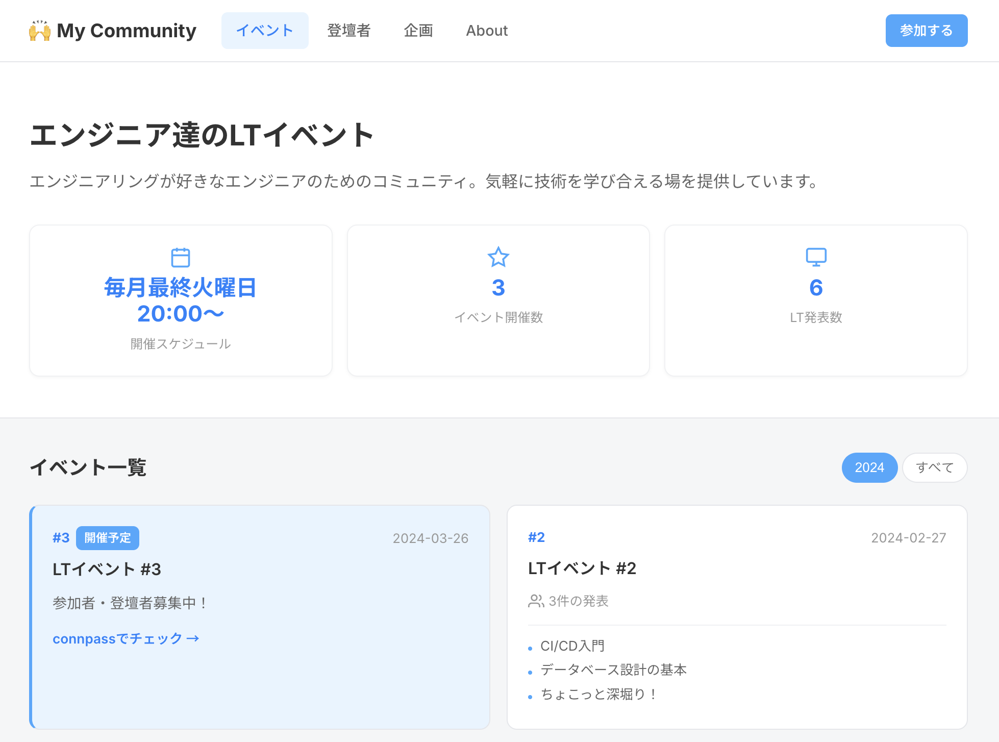

# 🙌 Engineer Community Portal

[](https://www.python.org/)
[](LICENSE)
[](https://github.com/features/actions)
[](https://pages.github.com/)<br>


エンジニアコミュニティのLTイベント情報を集約するポータルサイトのテンプレートです。

YAMLでデータを管理し、Python + Jinja2 で静的HTMLを生成するシンプルな構成。GitHub Pagesですぐにホスティングできます。



👉 **サンプルページ**: <https://unsolublesugar.github.io/engineer-community-portal/>

## 特徴

- **イベント一覧** — カード形式の一覧表示、年度フィルター、ページネーション
- **イベント詳細** — 発表タイトル、スライド埋め込み、YouTubeタイムスタンプ、前後ナビゲーション
- **登壇者一覧** — プロフィール・登壇履歴の検索・ソート・ページネーション
- **企画コーナー** — 特別企画のアーカイブ
- **About** — コミュニティ紹介・統計情報・運営メンバー
- **レスポンシブ対応** — PC・スマホ両対応
- **クリーンURL** — `.html` 拡張子なしでアクセス可能
- **OGP / Twitter Card** — SNSシェア時のプレビュー対応

## セットアップ

### 1. このテンプレートからリポジトリを作成

「Use this template」ボタンをクリックするか、リポジトリをクローンしてください。

```bash
git clone https://github.com/unsolublesugar/engineer-community-portal.git my-community-portal
cd my-community-portal
```

### 2. 依存パッケージをインストール

```bash
pip install -r requirements.txt
```

### 3. データをカスタマイズ

以下のファイルを自分のコミュニティに合わせて編集してください。

| ファイル | 内容 |
|---------|------|
| `data/community.yaml` | コミュニティ名、URL、運営メンバー等 |
| `data/speakers.yaml` | 登壇者のプロフィール情報 |
| `data/events/NNN.yaml` | 各イベントの発表情報 |
| `src/config/settings.py` | サイト名、説明、OGP設定 |

### 4. ビルド

```bash
python src/build.py
```

`output/` ディレクトリに静的HTMLが生成されます。

```bash
python -m http.server -d output 8000
```

### 5. デプロイ

GitHub にプッシュすると、GitHub Actions で自動ビルド＆デプロイされます。

リポジトリの Settings → Pages → Source で「GitHub Actions」を選択してください。

## データ構造

### イベントデータ（`data/events/NNN.yaml`）

```yaml
number: 1
title: 'LTイベント #1'
date: '2024-01-30'
connpass_url: https://example.connpass.com/event/000001/
youtube_url: ''
hashtag: '#MyLT'
talks:
- title: 発表タイトル
  speaker:
    name: 表示名
    id: speaker_id    # speakers.yaml の id と一致させる
  slide_url: ''       # スライドURL（埋め込みURL自動生成）
  youtube_timestamp: '0:10:00'
  tags:
  - タグ1
  - タグ2
```

### 登壇者マスター（`data/speakers.yaml`）

```yaml
- id: speaker_id
  name: 表示名
  icon_url: ""        # アイコン画像URL（任意）
  twitter: ""         # X(Twitter)アカウント名
  github: ""          # GitHubアカウント名
  qiita: ""           # Qiitaアカウント名
  zenn: ""            # Zennアカウント名
  website: ""         # Webサイト
```

## スライド埋め込み対応

以下のサービスのスライドURLから、埋め込みURLを自動生成します。

- Speaker Deck（oEmbed API経由）
- Google Slides
- SlideShare
- Docswell
- slides.com

## ディレクトリ構成

```
src/                Pythonソース・Jinja2テンプレート
├── build.py        メインビルドスクリプト
├── config/         設定ファイル
└── templates/      Jinja2テンプレート
data/               YAMLデータ
├── community.yaml  コミュニティ情報
├── speakers.yaml   登壇者マスターデータ
└── events/         イベントデータ
assets/             CSS・JavaScript・画像
output/             生成された静的ファイル（git管理外）
```

## ライセンス

[MIT License](LICENSE)
